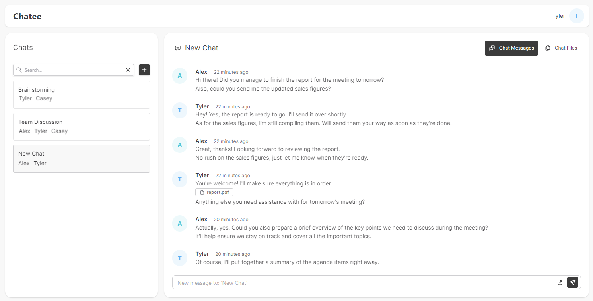

# Chatee

Chatee is a simple chat application created for testing and demonstration purpose. Chatee provides you with full end-to-end encryption communication with the use of [PrivMX Bridge](https://github.com/simplito/privmx-bridge) by Simplito. It is a great starting point for building your own chat application with end-to-end encryption.



## Features

Chatee provides essential chat features, including group chats and file attachments. All the data exchanged within Chatee is
end-to-end encrypted, meaning that only the end users can read (decrypt) their messages. It means that even the platform hosting
provider can’t access user data.

Chatee categorizes users into two distinct roles:

- **Staff**: Authorized personnel who administer user accounts and permissions.
- **Regular users**: Individuals who interact with the app's features and functionalities for communication.

All Staff users can invite others by sending them an invitation token generated inside the app. Before generating a
token you can decide whether the account will have Staff permissions or be a regular user. Regular users can create new
chats only with Staff members. Staff can add chats with all the users in the server, regardless of their status.

Chats occur in real-time. You can send text messages and files up to 50 MB.

---

## Basics

Chatee consist of two parts: **Web Application** and **Server Backend** (both written in Next.js). **Server Backend** manages **user accounts** and utilizes MongoDB for persistent data storage.

All the sent messages and files are managed by [PrivMX Bridge](https://github.com/simplito/privmx-bridge), to ensure they are properly encrypted and are not stored in your server environment.

## Requirements

- Node.js in 20.10 version;
- Docker for running PrivMX Bridge instance;
- MongoDB instance - you can instatiate MongoDB with our docker compose file, more info below.

## How to start?

- To begin, clone this repository. It includes the Chatee sources along with various helpful files.
- Copy or rename `./.env.example` to `./.env.local`. `.env.exemple` contains essential variables and / or placeholders. All environmental variables for local development should be put there, including MongoDB connection string, PrivMX Bridge URL, API Keys, PrivMX Solution & Context IDs. You can find more information about these variables in the following sections.

 ### **Start Bridge Instance**

 > To proceed, ensure that Docker is up and running.

To succesfully run Chatee, you need to have a running PrivMX Bridge instance. PrivMX Bridge is a service that provides end-to-end encryption for your communication. It is a crucial part of Chatee's architecture.

To set up a PrivMX Bridge instance locally clone [PrivMX Bridge Docker](https://github.com/simplito/privmx-bridge-docker) repository. Follow instructions included in its README. The PrivMX Bridge startup process will create all necessities required to run Chatee with end-to-end encryption, including essential ENV variables. After initialization, the terminal will output the following:

- **PrivMX Bridge URL** - address of the running PrivMX Bridge instance;
- **API Key ID** and **API Key Secret** - used to authorize Chatee requests to PrivMX Bridge;
- **Solution ID** - ID of the created Solution;
- **Context ID** - ID of one of the Contexts inside the Solution.

Paste them into the `./env.local` file created earlier.

> If you want to know more about PrivMX Bridge, visit our documentation [here](https://docs.privmx.dev/).

#### JWT Salt

Generate a random **JWT_SALT** using e.g. `openssl`:

```sh
openssl rand -base64 20
```

and paste it into your `.env.local`.

```ENV
JWT_SALT=GENERATED_RANDOM_SECRET
```

#### Next Public Backend URL

For demo purposes, Chatee runs in localhost (port 3000). `NEXT_PUBLIC_BACKEND_URL` configures the app's default address. In production environment, you can use a fully qualified domain name.

```ENV
NEXT_PUBLIC_BACKEND_URL=http://localhost:3000
```

### **Start MongoDB Instance**

You need a **MongoDB** Instance with replica sets for transactions.

For demo purpose, you can use the `docker-compose-mongo.yml` from this repository. Run the following command to start MongoDB Docker in your local environment:

```sh
docker-compose -f docker-compose-mongo.yml up
```

It will create a MongoDB instance running on `0.0.0.0:27017` with a replica set named **rs0**.

While using Docker and the provided `docker-compose-mongo.yml` file, you can use the following lines describing connection to your local MongoDB database:

```ENV
REPLICA_SET=rs0
MONGODB_URI=mongodb://127.0.0.1:27017/?replicaSet=$REPLICA_SET
```

Feel free to adjust these settings if you opt for a custom setup.

## Running the App

In a new terminal, go to project root folder.

```sh
npm install
npm run dev
```

Durning the first run,  Chatee server will create the first invitation token. It's important to  **copy and save it somewhere**, it will be used for login.
Go to <http://localhost:3000/sign-up> and create the first Staff user.

### Creating Threads

When creating threads (chat rooms) you’re given a list of all the users from your app.
Staff users can create chats with all the users in the app.
Regular users can create chats only with Staff.

## Production Deployments

1. For deployment, you will need [Docker](https://docs.docker.com/engine/install/ubuntu/) with [Docker Compose](https://docs.docker.com/compose/install/) installed on your machine
2. Create PrivMX Bridge Instance using our [PriMX Bridge docker repo](https://github.com/simplito/privmx-bridge-docker) 
    After a setup process you will receive Bridge secrets, you will need them later.
3. Clone this repository on your machine.
4. Copy or rename `.env.example` to `.env.production`.
    Using variables from step 2 fill your `.env.production` file with few modifications.
    If your PrivMX Bridge doesn't have a domain assigned to it, you should pass an IP and port of your machine 
    instead of `localhost`. 
    **PrivMX Bridge must be served via https**
5. Production docker compose comes with nginx container which needs certs for HTTPS connection
   To generate cert run:
    ```
    cd ./deployments
    mkdir -p certs && openssl req -x509 -nodes -days 365 -newkey rsa:2048 \
    -keyout certs/selfsigned.key -out certs/selfsigned.crt \
    -subj "/CN=<APP_DOMAIN_NAME>"
    ```
    If you don't have a domain name, you can pass `"localhost"` instead.  

    You can edit its configuration in `/deployments/nginx.conf` file, for example, if
    you want to change domain name of your app.
   To start your application, **run in root of your project**:
    ```sh
    PORT=3000 docker-compose -f docker-compose-production.yml up
    ```
6. After the first startup, you will be prompted with an invitation token for the first staff user.
    You can check it using:
   ```
   docker logs NAME_OF_CHATEE_CONTAINER 
   ```
7. Create first staff user on `/sign-up` page using your invite token

## License

[MIT](./LICENSE)
